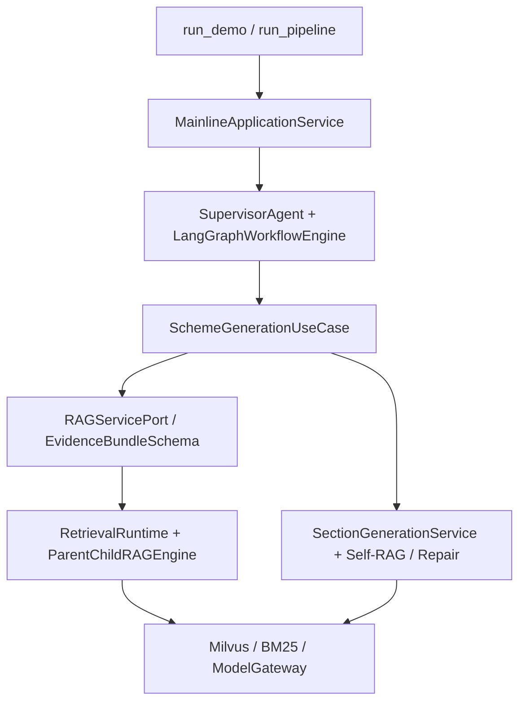
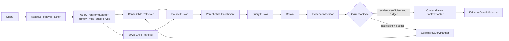
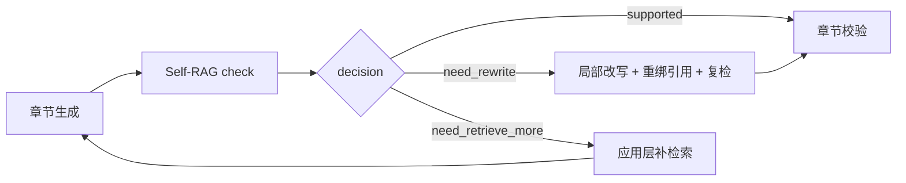

# RAG-Agent 锁定架构

当前主链是“确定性工作流 + 应用用例编排 + 固定 RAG 骨架 + 可替换插件”。暂不引入 LangGraph；LangChain 可以作为某个 Retriever、Prompt 或 Model Adapter 的实现，但不掌握系统编排权。

## 1. 总体分层

- Workflow 只负责固定 Agent 节点的状态隔离、提交、重试和 Trace。
- `SchemeGenerationUseCase` 拥有“检索—生成—补检索—复检—文档门禁”业务闭环。
- RAG 内核只生产证据，不生成最终答案。
- 业务层只依赖 `RAGServicePort` 和 `EvidenceBundleSchema`。

## 2. 固定检索骨架

在线只有一份 `StaticRetrievalSpec`：

- `backend/rag/config/static_retrieval_v1.yaml`：固定组件拓扑和插件实现；
- `intent_policy_v1.yaml`：Query Transform 意图规则；
- `retrieval_gate_policy_v1.yaml`：证据纠错轮次预算。

不再使用在线 Profile Catalog，也不再为 `hybrid / hyde / fusion / crag` 复制整套 YAML。

## 3. Adaptive-RAG 边界

`AdaptiveRetrievalPlanner` 只输出：

- `query_transform_mode`：`identity`、`multi_query`、`hyde` 三选一；
- `correction_budget`：允许的最大证据纠错轮数；
- 解释性的 `reason` 和 `signals`。

Planner 不预测证据是否充分，不提前打开 CRAG，也不组合 `multi_query + hyde`。纠错是否发生，只能在 Rerank 后由真实证据评估结果决定。

## 4. CRAG 的三个独立插件

| 插件 | 职责 | 禁止职责 |
|---|---|---|
| `EvidenceAssessor` | 评分、过滤并输出证据是否充分 | 不生成纠错 Query |
| `CorrectiveRetrievalGate` | 结合评估结果和剩余预算决定是否回检 | 不评分证据 |
| `CorrectiveQueryPlanner` | Gate 打开后生成有界纠错 Query | 不决定是否回检 |

每轮纠错都重新执行完整的召回、融合、Parent 回填、Rerank 和证据评估。

## 5. ContextGate 与 Lost-in-the-Middle

`ContextRequirements` 显式携带：

- 模型上下文窗口；
- Prompt 预留 Token；
- 章节证据 Token 预算；
- 最大证据数；
- 字符序列化安全上限。

`ContextGate` 根据候选证据的实测 Token 规模选择 default 或 Lost-in-the-Middle packer。`ContextPack` 对外保留 `items`、`rendered_text`、`token_budget`、`tokens_used` 和截断记录，最终 `EvidenceBundle.context` 使用同一份已打包文本。

## 6. Self-RAG 生成闭环

`need_retrieve_more` 优先于局部改写。用例会在同一章节预算内循环“补检索—重新生成—Self-RAG 复检”，直到通过、检索失败或预算耗尽。

`WorkflowBudget` 以章节为范围，硬限制：

- 补检索轮数；
- 局部改写轮数；
- LLM 调用次数；
- 预留输出 Token 总量。

## 7. 插件与主链的划分

| 能力 | 主链固定阶段 | 实现可替换 | 请求级选择 |
|---|---:|---:|---:|
| 向量 + BM25 混合召回 | 是 | 是 | 否 |
| Child 召回 + Parent 回填 | 是 | 是 | 否 |
| Fusion + Rerank | 是 | 是 | 否 |
| identity / Multi-Query / HyDE | 是 | 是 | 三选一 |
| 证据评估 | 是 | 是 | 否 |
| 纠错回检 | Gate 阶段固定 | Gate/Planner 可替换 | 由证据与预算决定 |
| Lost-in-the-Middle | ContextGate 固定 | 是 | 由上下文规模决定 |
| Self-RAG / Repair | 应用生成层 | 是 | 由生成检查结果决定 |

## 8. 暂不引入 LangGraph

当前 Workflow 是两个确定 Agent 节点，RAG 内部也是固定阶段加有界循环。现有引擎已具备状态隔离、提交、重试、Trace 和写入契约。只有在出现大量动态分支、持久化中断/恢复或跨进程长任务后，再评估 LangGraph。
