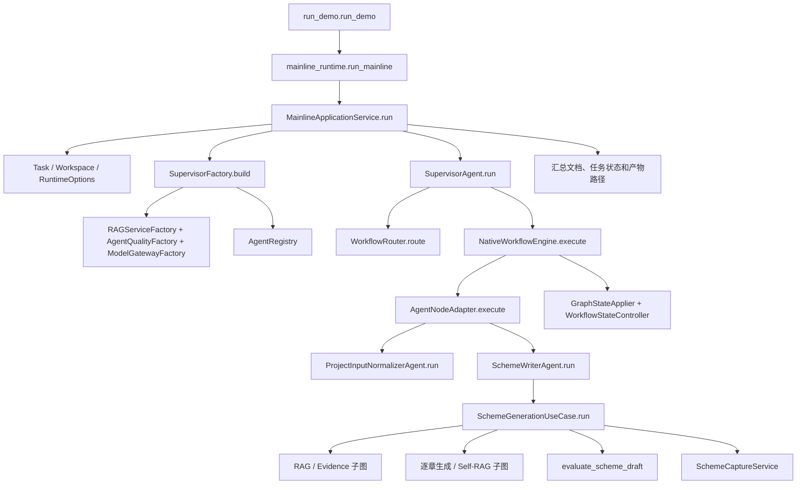
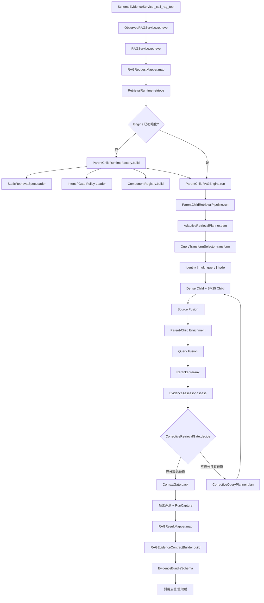
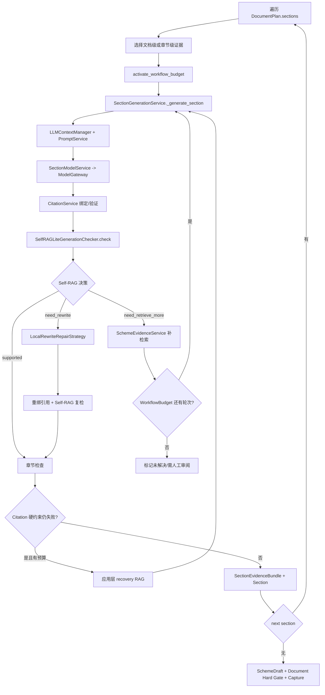

# `run_demo` 完整业务调用图

本图从 `scripts/run_demo.py::run_demo` 展开，省略 Pydantic 字段校验、序列化和普通 getter。

## 1. 顶层主链

Workflow 不再经过 `WorkflowStepDispatcher -> AgentStepHandler`。固定 Agent 节点由 `AgentNodeAdapter` 直接从 `AgentRegistry` 取出并执行，同时保留隔离状态副本和 Delta 提交边界。

## 2. RAG / Evidence 子图

注意：Planner 不决定是否执行纠错。`EvidenceAssessor` 每次都执行；Gate 只在证据不充分且剩余预算大于零时打开；`CorrectiveQueryPlanner` 只在 Gate 打开后运行。

## 3. 逐章生成 / Self-RAG 子图

`WorkflowBudget` 按章节统一统计检索轮数、改写轮数、LLM 调用数和预留输出 Token，所有恢复路径共享同一份预算。

## 4. 首次请求与复用

首次真实检索会解析活动索引、读取静态检索规格与两份小策略、构建 Retriever/Reranker/Context Packer 等资源。后续请求复用 Engine。只有活动索引指针改变并显式 reload 时，才会等待在途请求并原子替换 Engine。
